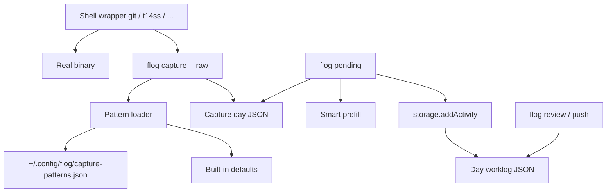

# Pending Captures Design

**Spec**: `.specs/features/pending-captures/spec.md`
**Status**: Approved

---

## Architecture Overview

Dedicated capture store under the flog data directory, separate from day worklogs. Shell wrappers for each configured command root forward the raw command line to `flog capture`, which owns pattern matching, same-day dedup, and append. `flog pending` lists open rows for one day and promotes via existing `addActivity`. Tempo `review`/`push` never read the capture store.



---

## Code Reuse Analysis

### Existing Components to Leverage

| Component | Location | How to Use |
| --------- | -------- | ---------- |
| Day path + atomic write | `src/storage.ts` | Mirror `dayPath` / temp+rename for capture files |
| `addActivity` | `src/storage.ts` | Promote writes real activities |
| `readDay` / defaults | `src/storage.ts`, `src/config.ts` | Period bounds for default morning/afternoon |
| Date helpers | `src/time.ts` | `todayIso`, `validateDate`, `formatDateLocal` |
| Relative `-N` expansion | `src/cli.ts` `expandRelativeDateArgs` | Already applies to `flog pending -1` |
| Config home | `src/config.ts` `createConfigStore` / `configPathDescription` | Resolve user-level patterns path beside Conf |
| Inquirer prompts | `@inquirer/prompts` (already used) | `checkbox`, `input`, `select` for triage |
| CLI test harness | `tests/cli.test.ts` | Same `FLOG_DATA_DIR` / `FLOG_CONFIG_DIR` isolation |

### Integration Points

| System | Integration Method |
| ------ | ------------------ |
| Shell rc | `flog hook install` appends a marked block sourcing generated wrappers |
| Day worklogs | Promote only; no schema change to `DayWorklog` |
| Tempo | None — payloads still built only from activities |

---

## Components

### Capture types

- **Purpose**: Shared types for captures and pattern config.
- **Location**: `src/types.ts` (extend) or `src/captures/types.ts` if it stays cleaner separate
- **Interfaces**: `CaptureStatus`, `CaptureEntry`, `DayCaptures`, `CapturePatternsConfig`
- **Dependencies**: none
- **Reuses**: same style as `DayWorklog` / `Activity`

### Pattern loader

- **Purpose**: Merge built-in defaults with user-level patterns file; expose match + command roots.
- **Location**: `src/captures/patterns.ts`
- **Interfaces**:
  - `defaultCapturePatterns(): string[]` — `git checkout -b`, `git switch -c`
  - `patternsPath(configDir?: string): string` — user file under flog config home
  - `loadCapturePatterns(): string[]` — defaults ∪ user file; missing file → defaults only
  - `commandRoots(patterns: string[]): string[]` — unique first tokens for wrapper generation
  - `matchesPattern(raw: string, patterns: string[]): boolean` — prefix match after whitespace normalize
- **Dependencies**: `fs`, config dir resolution from `config.ts`
- **Reuses**: `FLOG_CONFIG_DIR` / Conf cwd convention

**Match rule:** A pattern matches when the normalized raw command equals the pattern or has the pattern as a prefix followed by whitespace or end-of-string. Patterns are literal strings (not regex) in v1.

### Capture storage

- **Purpose**: Read/write per-day capture files; append with dedup; status updates.
- **Location**: `src/captures/storage.ts`
- **Interfaces**:
  - `captureDayPath(dataDir: string, date: string): string` → `{dataDir}/captures/{yyyy}/{mm}/{date}.json`
  - `readDayCaptures(dataDir, date): Promise<DayCaptures>`
  - `appendCapture(dataDir, date, raw, now?): Promise<CaptureEntry | undefined>` — `undefined` on quiet dedup miss or empty after trim when called from match path
  - `setCaptureStatus(dataDir, date, id, status, extra?): Promise<CaptureEntry>`
  - `listPending(dataDir, date): Promise<CaptureEntry[]>`
- **Dependencies**: `fs/promises`, `time.validateDate`
- **Reuses**: atomic temp+rename write pattern from `storage.ts`

### Capture command logic

- **Purpose**: Normalize raw text, match patterns, append pending row.
- **Location**: `src/captures/capture.ts`
- **Interfaces**:
  - `captureCommand(dataDir, raw, now?): Promise<"captured" | "duplicate" | "no-match">`
  - Empty raw → throw (CLI maps to non-zero exit)
- **Dependencies**: patterns + capture storage
- **Reuses**: `todayIso()` for default date

### Smart prefill

- **Purpose**: Derive promote form defaults from raw command text.
- **Location**: `src/captures/prefill.ts`
- **Interfaces**:
  - `prefillFromRaw(raw: string): { id: string; description: string }`
- **Rules**:
  - `id`: last `_`-separated token that is all digits, else last whitespace token that is all digits, else `""`
  - `description`: for `git checkout -b` / `git switch -c` / similar, take the branch argument; strip `feature/` prefix; replace `_` with spaces except keep ticket handling; if no structured parse, use full raw
- **Dependencies**: none
- **Reuses**: none

### Period default

- **Purpose**: Pick morning vs afternoon from capture timestamp.
- **Location**: `src/captures/period.ts`
- **Interfaces**:
  - `defaultPeriodForCapture(capturedAt: string, day: DayWorklog): PeriodName` — compare local HH:MM of `capturedAt` to midday boundary: if before `afternoon.start` (or before 12:00 if needed) → morning, else afternoon. Prefer: `< afternoon.start` → morning.
- **Dependencies**: day worklog period bounds
- **Reuses**: `readDay` for bounds

### Hook installer

- **Purpose**: Idempotent install/uninstall of shell wrapper block.
- **Location**: `src/captures/hooks.ts`
- **Interfaces**:
  - `installHooks(options?: { rcPath?: string; shell?: "zsh" | "bash" }): Promise<{ rcPath: string }>`
  - `uninstallHooks(options?: { rcPath?: string }): Promise<{ rcPath: string }>`
  - `renderWrapperScript(roots: string[], flogBin: string): string`
- **Behavior**:
  - Resolve flog bin via `process.argv[1]` / install path
  - Generate `{configDir}/capture-wrappers.sh` containing functions for each command root
  - Each function: `command <root> "$@"`, then `flog capture -- "<root> …"` best-effort (ignore capture failures so the real command’s exit code wins)
  - Append/replace a marked block in `~/.zshrc` (default) or `~/.bashrc`: `# >>> flog capture hooks >>>` … `# <<< flog capture hooks <<<` that sources the generated file
  - Install is idempotent (replace marked block / regenerate wrappers file)
- **Dependencies**: patterns (`commandRoots`), `fs`, `os`
- **Reuses**: `getInstallRoot` / config paths

### CLI wiring

- **Purpose**: Expose `capture`, `pending`, `hook install|uninstall`.
- **Location**: `src/cli.ts` (+ small `src/captures/pending-cli.ts` if triage flow is large)
- **Commands**:
  - `flog capture -- <raw...>` / `flog capture <raw...>` — empty → error; no-match → quiet success (exit 0) for wrapper friendliness; duplicate → quiet success; captured → brief stderr line
  - `flog pending [--date]` — checkbox of pending; then for each selected: input id, input description, select period; write activity + mark promoted. Separate discard multi-select or per-item discard action after list (design choice: after checkbox, ask action Promote vs Discard for the selection; Promote runs edit loop, Discard marks all selected discarded)
  - `flog hook install` / `flog hook uninstall`
- **Dependencies**: captures modules, `addActivity`, inquirer
- **Reuses**: `context()`, date options, existing error style

**Triage action detail:** One checkbox to select rows → `select` prompt: `promote` | `discard` | `cancel`. Promote runs edit loop per selected item (cancel mid-item leaves that item pending and stops further items). Discard marks all selected `discarded`.

### Docs

- **Purpose**: Document patterns file path and examples (`git clone`, `t14ss -b`).
- **Location**: `README.md` (Commands + short Captures section)

---

## Data Models

### CaptureEntry / DayCaptures

```typescript
type CaptureStatus = "pending" | "promoted" | "discarded";

type CaptureEntry = {
  id: string; // stable id, e.g. ulid/uuid/nanoid-like random
  raw: string;
  capturedAt: string; // ISO
  status: CaptureStatus;
  promotedAt?: string;
  discardedAt?: string;
  activityPeriod?: PeriodName;
};

type DayCaptures = {
  schemaVersion: 1;
  date: string; // YYYY-MM-DD
  captures: CaptureEntry[];
};
```

**Relationships:** Promote creates an `Activity` on `DayWorklog`; capture row keeps history only (no hard FK required). Optional `activityPeriod` recorded on promote for audit.

### Capture patterns file (user-level)

Path: `{flog config dir}/capture-patterns.json` (same directory as Conf store; respects `FLOG_CONFIG_DIR`).

```typescript
type CapturePatternsFile = {
  patterns: string[];
};
```

Merged as: `unique(defaultCapturePatterns() ∪ file.patterns)`. Missing file → defaults only. Invalid JSON → error on `capture` / `hook install` with a clear message (fail loud on corrupt config; missing is OK).

---

## Error Handling Strategy

| Error Scenario | Handling | User Impact |
| -------------- | -------- | ----------- |
| Empty `flog capture` | Throw; CLI non-zero | Message: capture text required |
| No pattern match from wrapper | Exit 0, no write | Silent; real command unaffected |
| Same-day duplicate pending raw | Exit 0, no write | Silent dedup |
| Corrupt patterns JSON | Throw on load | Clear path + parse error |
| Corrupt capture day JSON | Throw on read | Clear path + error (same spirit as broken day worklog) |
| Cancel promote mid-edit | Stop loop; no activity for current/remaining | Prior successful promotes in the same run stay applied |
| `hook install` without writable rc | Throw | Message with path |
| Capture write failure after real command | Wrapper ignores capture error | User still gets git/t14ss result; stderr optional one-line from flog |

---

## Risks & Concerns

| Concern | Location | Impact | Mitigation |
| ------- | -------- | ------ | ---------- |
| `cli.ts` is already a large command surface | `src/cli.ts` | Pending interactive flow could bloat further | Keep triage in `src/captures/pending-cli.ts`; cli only registers commands |
| Activity `id` field unused by current `flog m` (empty string; full text in description) | `src/cli.ts` activityCommand; `tests/cli.test.ts` | Promote using real `id`+`description` differs from manual habit but matches `Activity` + Tempo `{id} - {desc}` | Promote writes structured id/description; do not change `flog m` parsing in this feature |
| Shell wrappers intercept all `git` invocations | hooks design | Tiny Node cost per git call; risk of wrapper recursion | Use `command git` / `command "$root"`; capture failures never change exit code |
| Interactive tests are awkward with inquirer | `tests/cli.test.ts` | Hard to E2E the checkbox flow | Unit-test storage/prefill/patterns/hooks rendering; CLI tests for `capture` + empty pending; promote logic testable via exported functions with injected answers if needed |
| No `.specs/STATE.md` existed | project root | Cross-feature constraints untracked | Create STATE with AD-001 for capture-store boundary |

---

## Tech Decisions

| Decision | Choice | Rationale |
| -------- | ------ | --------- |
| Capture persistence | Sibling tree `worklogs/captures/YYYY/MM/date.json` | Keeps Tempo/day schema untouched; durable history |
| Pattern syntax | Literal prefix strings | Enough for listed commands; no regex complexity in v1 |
| Wrapper strategy | Functions per command root + Node match | One match engine; install derives roots from patterns |
| Capture timing | After real command; best-effort | Preserves exit codes; intent still logged if command fails |
| Duplicate policy | Quiet skip when same `raw` already `pending` that day | Spec assumption; promoted/discarded same raw may be captured again |
| Triage UX | Checkbox → promote/discard/cancel → edit loop | Matches approved multi-select flow |
| Stable capture ids | `crypto.randomUUID()` | Built-in Node 20; no new dependency |
| Patterns path | `{configDir}/capture-patterns.json` | User-level, outside git, next to Conf |

**Project-level:** Capture store remains outside `DayWorklog` — see `AD-001` in `.specs/STATE.md`.
